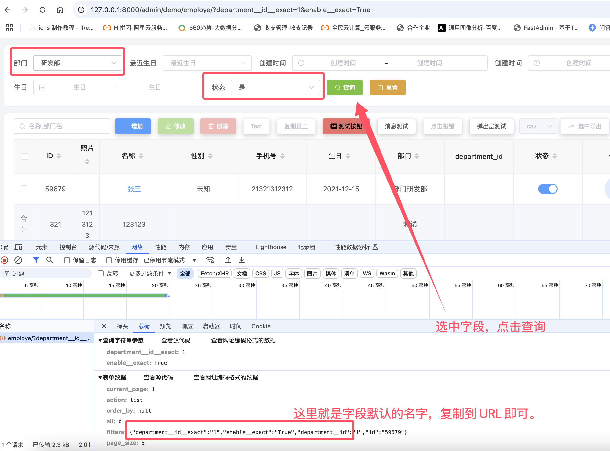

# 7.10

> 发布日期：2024-11-15

## 新增功能

+ 支持页面查询参数筛选表格

## 查询参数说明

+ 参数名

参数完全兼容 django 的 queryset 查询参数

例如：
```python

qs.filter(id=1)

```

此时界面上相关搜索字段也许不会选中，这是因为 pro 的 UI 字段参数与 django 的可能不一致，所以需要手动指定

例如Demo 中，员工管理模块，指定默认部门

```shell
http://127.0.0.1:8000/admin/demo/employe/?department__id__exact=1
```

指定默认状态：

```shell
http://127.0.0.1:8000/admin/demo/employe/?department__id__exact=1&enable__exact=True
```

### 如何查找 UI 字段的名称？

选中某些筛选条件，然后点击查询，这时候打开 chrome开发者工具，点击网络，找到刚刚请求的 URL，点击载荷，这时候会看到表单数据中有一个 filters字段，这个字段就是 UI 字段的名称和值



### Value处理

在 django 中，如果是布尔值，那么默认是 True 和 False，那么Url中也需要传入 django 的布尔值，例如：

```shell
aa=True&bb=False
```

如果传入的是 json 或者 js 中的 `true`和`false`，那么 django 将会告诉你一个错误。